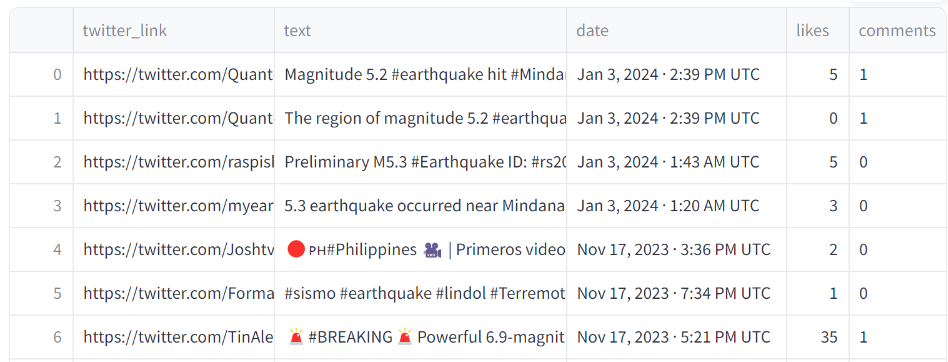

# DiRA: Disaster Response Assistance

A Decision Support System for better Disaster Response Management.

[]

### How to run it on your own machine

1. Install the requirements

   ```
   $ pip install -r requirements.txt
   ```

2. Run the app

   ```
   $ streamlit run streamlit_app.py
   ```

3. Upload a CSV file for analysis.

### What files can you upload?

1. Your CSV file should contain the following two columns:
   ```
   text: This column should include the full text of each tweet.
   ```
   ```
   date: This column should specify the date when the tweet was created.
   ```

2. Sample CSV file format:
   
   

3. Here are also datasets you can upload for testing.
   ```
   insert drive link here
   ```
    